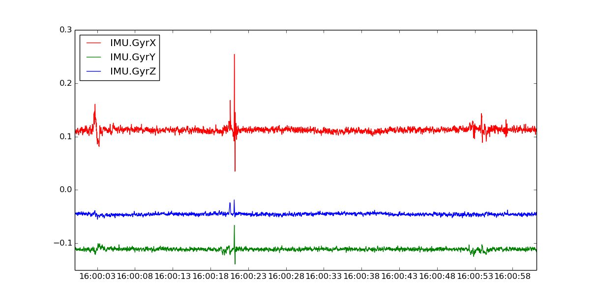

drones_logs
===========

Ardupilot logs from the drones.

### How to visualize the logs:
For this steps you need to use an Ubuntu machine and have installed `mavproxy` (`pip install mavproxy` should do it). Having that, we can convert the logs from the binary format that they are stored (`.BIN`) to a plain text format using the `mavlogdump.py` tool:
```bash
mavlogdump.py 1.BIN > log_plaintext.txt
```

Now we should be able to see the content of this log just by reading the file:
```bash
cat log_plaintext.txt
...
1969-12-31 16:00:00.20: IMU {TimeMS : 63947, GyrX : 0.0350766777992, GyrY : -0.0315700694919, GyrZ : 0.0244770497084, AccX : -0.730231523514, AccY : -0.74220252037, AccZ : -10.3549222946}
1969-12-31 16:00:00.04: MAG {TimeMS : 63957, MagX : 0, MagY : 0, MagZ : 0, OfsX : 0, OfsY : 0, OfsZ : 0, MOfsX : 0, MOfsY : 0, MOfsZ : 0}
1969-12-31 16:00:00.22: IMU {TimeMS : 63967, GyrX : 0.0324161276221, GyrY : -0.0321021787822, GyrZ : 0.0250091589987, AccX : -0.633266329765, AccY : -0.744596719742, AccZ : -10.3309803009}
1969-12-31 16:00:00.24: IMU {TimeMS : 63987, GyrX : 0.0324161276221, GyrY : -0.0294416323304, GyrZ : 0.0287339277565, AccX : -0.575805485249, AccY : -0.784101068974, AccZ : -10.5368814468}
1969-12-31 16:00:00.26: IMU {TimeMS : 64007, GyrX : 0.0340124554932, GyrY : -0.0294416323304, GyrZ : 0.030862364918, AccX : -0.654814183712, AccY : -0.811634361744, AccZ : -10.2902784348}
1969-12-31 16:00:00.28: IMU {TimeMS : 64027, GyrX : 0.0308197960258, GyrY : -0.0326342917979, GyrZ : 0.0297981463373, AccX : -0.76853877306, AccY : -0.836773514748, AccZ : -10.6158905029}
1969-12-31 16:00:00.30: IMU {TimeMS : 64047, GyrX : 0.0340124554932, GyrY : -0.0310379602015, GyrZ : 0.0287339277565, AccX : -0.678756177425, AccY : -0.770932972431, AccZ : -10.4459018707}
1969-12-31 16:00:00.06: MAG {TimeMS : 64057, MagX : 0, MagY : 0, MagZ : 0, OfsX : 0, OfsY : 0, OfsZ : 0, MOfsX : 0, MOfsY : 0, MOfsZ : 0}
1969-12-31 16:00:00.06: BARO {TimeMS : 64057, Alt : -0.0284720920026, Press : 100962.296875, Temp : 37.31}
1969-12-31 16:00:00.06: CTUN {TimeMS : 64057, ThrIn : 322, AngBst : 2, ThrOut : 324, DAlt : 0.0, Alt : 0.019999999553, BarAlt : -0.02, DSAlt : 0.0, SAlt : 0.0, DCRt : 0, CRt : 11}
1969-12-31 16:00:00.06: ATT {TimeMS : 64057, DesRoll : -12.77, Roll : 6.47, DesPitch : -12.77, Pitch : -6.26, DesYaw : 51.46, Yaw : 56.2}
1969-12-31 16:00:00.06: EKF1 {TimeMS : 64057, Roll : 0.0, Pitch : 0.0, Yaw : 0.0, VN : 0.0, VE : 0.0, VD : 0.0, PN : 0.0, PE : 0.0, PD : 0.0, GX : 0.0, GY : 0.0, GZ : 0.0}
1969-12-31 16:00:00.06: EKF2 {TimeMS : 64057, AX : 50, AY : 0, AZ : 0, VWN : 0.0, VWE : 0.0, MN : 0, ME : 0, MD : 0, MX : 0, MY : 0, MZ : 0}
1969-12-31 16:00:00.06: EKF3 {TimeMS : 64057, IVN : 0.0, IVE : 0.0, IVD : 0.0, IPN : 0.0, IPE : 0.0, IPD : 0.0, IMX : 0, IMY : 0, IMZ : 0, IVT : 0.0}
1969-12-31 16:00:00.06: EKF4 {TimeMS : 64057, SV : 0.0, SP : 0.0, SH : 0.0, SMX : 0.0, SMY : 0.0, SMZ : 0.0, SVT : 0.0, OFN : 0, EFE : 0, FS : 0, DS : 0}

...
```

The logs can be plotted using the `mavgraph.py` tool. 
For example, the gyroscopes can be visualized using:

``` bash
mavgraph.py 10.BIN "IMU.GyrX" "IMU.GyrY" "IMU.GyrZ"
```
A new window should appear and plot the gyros:


Similarly, we can plot the accelerometers:
``` bash
 mavgraph.py 10.BIN "IMU.AccX" "IMU.AccY" "IMU.AccZ"
```
or even the attitude (pitch, roll and yaw):
``` bash
 mavgraph.py 10.BIN "ATT.Roll" "ATT.Pitch" "ATT.Yaw"
```

(for more possible plots, convert any log into plain text with the `mavlogdump.py` script and get inspiration reading the log)


### How to contribute with logs:
We are happy to receive logs from anyone who feels like sharing but we ask you to do it under the following policies:
- Logs should be cataloged for each board kind: `erle-board`, `pxf`, etc.
- The logs should be cataloged under the kind of vehicled: `copter`, `plane` or `rover`.
- The logs should be clasified by date (day-month-year format)
- The logs should be cataloged by the sensors used (imu-baro-gps-others form). E.g.: mpu9250-ms5611 or mpu6000-ms5611 and so on.

###Q&A
#### How do I identify which sensors my vehicle is using?
The sensors used are printed when copter, rover or plane are launched:
```
...
Init ArduCopter V3.2-rc3 (588ab0ef)

Free RAM: 4096
FW Ver: 120
----------------------------------------


load_all took 100us
IMU: MPU9250
Barometer: MS5611 SPI
...
```

#### How do I change the sensors that my robot is using?
There's a script that does the change for you. After running the script you just need to recompile. E.g.: to change to the `MPU6000` you would do:
```bash
cd ardupilot/Tools/Linux_HAL_Essentials
root@beaglebone:~/ardupilot/Tools/Linux_HAL_Essentials# source sensor-select.sh mpu6000
```
